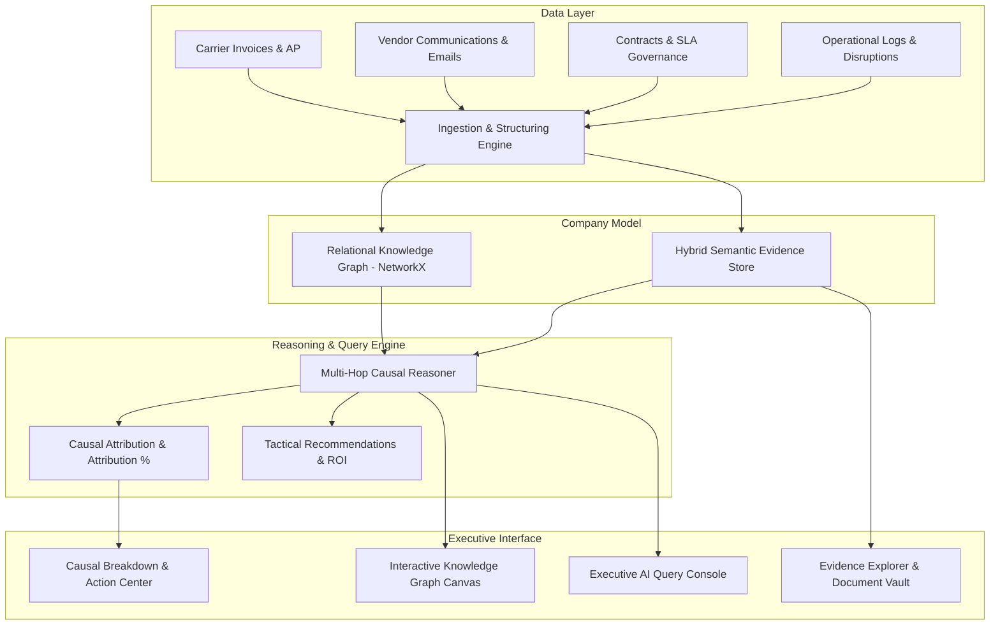

# AI-Company Brain

An enterprise-grade **operational intelligence layer** that moves beyond basic unstructured RAG into a structured, relational, process-aware AI model of the enterprise.

---

## Key Differentiators vs. Traditional RAG

| Dimension | Traditional RAG Chatbot | AI-Company Brain |
|---|---|---|
| **Data Scope** | Mostly documents & text | Invoices, ERP transactions, Emails, Contracts, Incidents, Routes |
| **Understanding** | Semantic vector similarity | Multi-relational Knowledge Graph (people ↔ processes ↔ entities ↔ events) |
| **Reasoning** | "Find chunks → summarize" | "Traverse graph → trace causality → attribute financial impact → recommend actions" |
| **Memory** | Stateless or session-based | Persistent enterprise model updated dynamically as documents are ingested |
| **Output** | Text answers + generic citations | Executive summary + step-by-step reasoning + visual causal attribution + grounded evidence trail + tactical next steps |

---

## System Architecture



---

## Project Structure

```
Company_brain_AI/
├── backend/
│   ├── app/
│   │   ├── main.py                     # FastAPI application entrypoint with CORS
│   │   ├── models/schemas.py           # Pydantic schemas for Graph, Evidence, Causal Chains
│   │   ├── services/
│   │   │   ├── graph_service.py        # NetworkX multi-relational graph store & traverser
│   │   │   ├── vector_service.py       # Hybrid semantic & lexical evidence search
│   │   │   ├── reasoning_engine.py     # Multi-hop causal attribution engine
│   │   │   └── ingestion_engine.py     # Dynamic document extraction and graph connector
│   │   └── api/
│   │       ├── routes_query.py         # /api/query & /api/sample-queries
│   │       ├── routes_graph.py         # /api/graph, /stats, /node/{id}
│   │       └── routes_ingest.py        # /api/ingest & /api/evidence/{id}
│   ├── data/seed/seed_data.py          # Realistic seed data (Apex Freight, Swift, Nordic)
│   └── requirements.txt
├── frontend/
│   ├── src/
│   │   ├── components/
│   │   │   ├── Header.tsx              # Brand, live graph metrics, tab selector, + Ingest CTA
│   │   │   ├── GraphViewer.tsx         # Interactive HTML5 Canvas force-directed graph
│   │   │   ├── ChatInterface.tsx       # Executive query console & reasoning stepper
│   │   │   ├── CausalAttributionView.tsx # Quantified root-cause drivers & tactical action cards
│   │   │   ├── EvidenceDrawer.tsx      # Grounded source document deep-dive & citation copy
│   │   │   ├── EvidenceExplorer.tsx    # Searchable vault of all underlying contracts/invoices/emails
│   │   │   └── IngestionModal.tsx      # Real-time document parser and graph linker
│   │   ├── services/api.ts             # REST client for backend API
│   │   ├── App.tsx                     # Main state coordinator & split-screen dashboard
│   │   └── index.css                   # Custom design system with glassmorphism & dark theme
│   ├── package.json
│   └── vite.config.ts
└── README.md
```

---

## Quickstart Guide

### 1. Launch the Backend (FastAPI)
```bash
cd backend
pip install -r requirements.txt
uvicorn app.main:app --host 0.0.0.0 --port 8000 --reload
```
API Documentation will be available at: `http://localhost:8000/docs`.

### 2. Launch the Frontend (Vite + React)
```bash
cd frontend
npm install
npm run dev
```
The application will launch at: `http://localhost:5173`.

---

## Core Scenarios Handled in MVP

1. **"Why did freight delivery costs surge in Q3 for Northeast routes?"**
   - Traces from `Route 101` to `Apex Freight Solutions` invoices `INV-APX-8921` and `8934`.
   - Discovers $12,200 unapproved fuel escalation violating **Contract Clause 4.2** (14-day notice requirement) and $8,550 port congestion accessorial fees without required ELD logs.
   - Attributed root cause: 58.8% unauthorized fuel surcharge, 41.2% terminal gate dwell fees.
   - Generates actionable recovery recommendations (dispute letter draft, claw back $12,200, shift volume to Swift).

2. **"Which carrier had SLA breaches and what liquidated damages are recoverable?"**
   - Audits carrier On-Time Delivery rates (Apex collapsed to 72.4% vs 90% SLA).
   - Identifies 3 severely delayed shipments (APX-TRK-7711, 7712, 7720).
   - Computes $4,000 enforceable liquidated damages under **CTR-APX-2025 §7.1**.

3. **"What alternative capacity exists to bypass Newark port bottlenecks?"**
   - Identifies SwiftLogistics capacity offer (`EML-SWF-312`) with 15 dedicated vans in Allentown at locked $1,850/load flat rate.
   - Quantifies savings (~$950 per load) and 48-hour transit reduction.

4. **Dynamic Ingestion**:
   - Add new invoices, emails, or terminal status reports in the UI and watch them automatically parsed, categorized, and linked to carriers and routes in the live Knowledge Graph.
